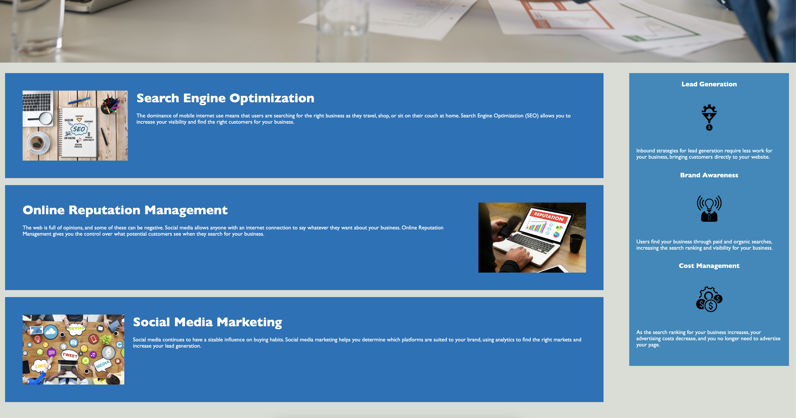

# homework-01-refactor-code

As developers, we need to have the ability to refactor code to make it more useful and understandable for all our colleagues.
With this approach, this is the result that I made.
Looking for your responses and comments. Thanks

